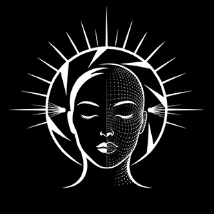

<div align="center">
  
</div>
<h1 align="center">XXG Portrait Rebuild Light</h1>
<p align="center">
  <a href="LICENSE"></a>
  <a href=""></a>
  <a href=""></a>
  <a href=""></a>
  <a href=""></a>
</p>

English | [简体中文](README.zh-CN.md) | [日本語](README.ja.md) | [한국어](README.ko.md)

`xxg-portrait-rebuild-light` is an image-edit skill for existing portrait photos. It reconstructs the key light, fill, shadows, and background atmosphere with a director-led lighting workflow while restoring clean, healthy, low-contrast photographic skin microtexture.

The skill changes the lighting without redrawing the person. It preserves identity, facial structure and proportions, natural slight asymmetry, expression, pose, camera view, and composition. It avoids plastic skin, grainy skin, dirty color variation, and fake depth made by exaggerating wrinkles.

## Key features

- Repairs plastic smoothness, excessive skin smoothing, and wax-like rendering.
- Preserves original lip lines, eye-area detail, restrained sebum highlights, and scale-appropriate microtexture.
- Repairs weak backlighting, disconnected indoor window light, flat lighting, unintended crushed shadows, and highlights with no physical source.
- Supports soft window light, commercial soft light, Rembrandt lighting, cinematic low-key lighting, golden hour, dual-color neon, and diagonal hard light.
- Adds at most one physically coherent atmosphere effect: window shadow, tree shadow, background bokeh, sunset flare, subtle volumetric light, or a full-black backlit subject silhouette.
- Controls subject and background in layers: key light and exposure intent first, then fill, shadows, ambient light, and color temperature.
- Preserves identity, facial feature size and position, expression, pose, wardrobe, background structure, and source framing.
- Reduces the skin-detail target automatically when the face is small, without canceling the requested lighting change.
- Uses the current agent's own image-generation or image-editing capability by default; no separate API is required.
- If the current agent has no image-edit capability, or the edit misses the target, returns one complete compact image-edit prompt.
- Never uses Pillow, NumPy, OpenCV, ImageMagick, or temporary filter scripts to produce the delivered image.


## Core method

The skill first makes a director-style lighting decision internally:

```text
Key light → Exposure intent → Fill → Shadow → Subject → Background → Atmosphere
```

The prompt sent to the image model is compressed into four lines, usually 80–160 English words:

```text
Edit: keep the same person and composition; rebuild only lighting and skin rendering.
Lighting: one key light + exposure intent + fill/shadow relation + background response + optional single atmosphere effect.
Skin: clean, low-contrast photographic microtexture appropriate to the visible face scale.
Constraints: no identity change, beauty reshaping, smoothing, grain overlay, dirty color variation, or background redraw.
```

The skill does not pile identity audits, object inventories, repeated negatives, and several photographic styles into one prompt. That often causes constraints to cancel each other or produces an unchanged copy.

Physical lighting takes priority over keeping every detail visible. The skill selects an exposure intent from `source-matched`, `balanced`, `highlight-priority`, `shadow-priority`, `low-key`, `silhouette`, and `high-key`. Sunset backlight may naturally darken the unlit side of the face or create a partial silhouette. Low-key and hard lighting may contain near-black shadows. Fill is used only when information that should remain readable is lost without a plausible cause.

`A6` is a forced override: whenever selected, it switches to silhouette exposure, moves the effective light behind the person, removes all fill and catchlights, and renders the entire subject interior black. The selected L and T recipes control only the backlight and background response; the S recipe is not rendered visibly.

## Recipes

Choose only:

```text
one L lighting recipe + one S skin recipe + one T color-temperature recipe + zero or one A atmosphere recipe
```

### Lighting L

| Code | Purpose |
| --- | --- |
| `L0` | Match the source; repair only flat light, unexplained crushed shadows, abnormal highlights, and harsh transitions |
| `L1` | Natural backlight, highlight-priority by default; add fill only when explicitly requested |
| `L2` | Soft natural window light |
| `L3` | Large commercial soft light |
| `L4` | Outdoor skylight |
| `L5` | Indoor practical and mixed lighting |
| `L6` | Hard single-point light or direct sunlight |
| `L7` | Low-key diagonal narrow light beam |
| `L8` | Classic editorial Rembrandt lighting |
| `L9` | Cinematic low-key warm key / cool ambient light |
| `L10` | Golden-hour sunset side backlight |
| `L11` | Cyberpunk cyan/magenta dual-tone neon |
| `L12` | Clean, even commercial soft light |

### Skin S

| Code | Purpose |
| --- | --- |
| `S0` | Small face or wide shot; restore only clean skin tone and natural reflection |
| `S1` | Default for medium shots; low-contrast microtexture with original lip and eye-area detail |
| `S2` | High-resolution close-up; region-aware pores, fine vellus hair, and existing details |

### Color temperature T

| Code | Purpose |
| --- | --- |
| `T0` | Preserve the source white balance |
| `T1` | Neutral natural daylight |
| `T2` | Golden warm light with healthy neutral zones retained in the skin |
| `T3` | Warm key light with cool background ambience |
| `T4` | Cyan/magenta neon relationship |

### Atmosphere A

| Code | Purpose |
| --- | --- |
| `A0` | Add no atmosphere effect |
| `A1` | Soft window shadow |
| `A2` | Sparse natural tree shadow |
| `A3` | Soft bokeh restricted to the defocused background |
| `A4` | Gentle lens flare aligned with the sunset direction |
| `A5` | Very subtle volumetric light with sparse dust motes |
| `A6` | Force the entire backlit subject to a clean black silhouette; no face, skin, hair, or clothing detail remains visible inside |

See [Lighting, skin, color-temperature, and atmosphere recipes](references/lighting-skin-color-temperature-recipes.md) for detailed prompt clauses.

## Image capabilities by agent

| Agent | Default route |
| --- | --- |
| Codex | Read the `$imagegen` rules, discover the actual tool in `ALL_TOOLS`, prefer `tools.image_gen__imagegen`, and pass source images through `referenced_image_paths` |
| Claude Code | Use the image-generation or image-editing capability installed or built into the current environment |
| OpenClaw | Use the imagegen skill or native image action enabled for the current agent |
| Other agents | Use an equivalent image-edit capability explicitly exposed by the tool registry |

In Codex, the skill never guesses `tools.image_gen` or `input_image`. It returns a prompt handoff only after tool discovery confirms that no compatible image capability exists. If the real image tool fails, produces an almost unchanged image, changes identity, or dirties the skin, the skill also returns a short copy-ready prompt.

## Requirements

- An agent that supports directory-based `SKILL.md` skills.
- An image-generation or image-editing capability in the current agent.
- Python 3.9 or newer, used only for read-only aspect-ratio, mask, and region checks.
- Pillow 9.1 or newer, used only for read-only analysis and never to create the final image.

Install the read-only script dependencies:

```bash
python3 -m pip install -r ./xxg-portrait-rebuild-light/requirements.txt
```

## Install in Codex

Personal skill:

```bash
mkdir -p ~/.codex/skills
cp -R ./xxg-portrait-rebuild-light ~/.codex/skills/
```

Shared Agent Skills directory:

```bash
mkdir -p ~/.agents/skills
cp -R ./xxg-portrait-rebuild-light ~/.agents/skills/
```

For a project-level install, place it in `.agents/skills/` at the project root. Invoke it explicitly with `$xxg-portrait-rebuild-light`.

## Install in Claude Code

Personal install:

```bash
mkdir -p ~/.claude/skills
cp -R ./xxg-portrait-rebuild-light ~/.claude/skills/
```

Project install:

```bash
mkdir -p .claude/skills
cp -R ./xxg-portrait-rebuild-light .claude/skills/
```

Invoke it with `/xxg-portrait-rebuild-light`.

## Install in OpenClaw

Local install:

```bash
openclaw skills install ./xxg-portrait-rebuild-light \
  --as xxg-portrait-rebuild-light
```

Shared install:

```bash
openclaw skills install ./xxg-portrait-rebuild-light \
  --as xxg-portrait-rebuild-light \
  --global
```

You can also copy the complete directory into the current agent workspace's `skills/` directory or the shared `~/.openclaw/skills/` directory.

## Install in other agents

Copy the complete `xxg-portrait-rebuild-light/` directory into the agent's personal or project skill root. Preserve the relative structure of `SKILL.md`, `requirements.txt`, `references/`, `scripts/`, and `agents/`, then reload the skill list.

## Usage examples

### Classic fashion editorial

```text
Use $xxg-portrait-rebuild-light to edit this portrait with L8 + S2 + T1 + A0.
A large soft key from the upper front-side creates restrained Rembrandt lighting; subtle fill preserves the eye socket, one cheek falls into a deep soft shadow, and the eyes receive one source-consistent catchlight. Keep the skin clean and healthy with low-contrast photographic microtexture.
```

### Cinematic low-key warm/cool

```text
Use $xxg-portrait-rebuild-light to edit this portrait with L9 + S1 + T3 + A5.
A warm side key shapes the lit and shadow sides. Use low-key exposure with no frontal fill, allowing the unlit side to approach black. Keep cool color only in the background and rim, with extremely subtle volumetric dust; no dirty gray skin or exaggerated wrinkles.
```

### Golden-hour backlight

```text
Use $xxg-portrait-rebuild-light to edit this portrait with L10 + S1 + T2 + A4.
Warm sunset light from the side-rear outlines the hair and shoulders. Expose for the sunset highlights with no frontal fill; let the unlit side of the face fall naturally into a partial silhouette, allow slight bloom on lit edges, and give the background matching oblique warm light and long shadows.
```

### Cyberpunk neon

```text
Use $xxg-portrait-rebuild-light to edit this night portrait with L11 + S1 + T4 + A3.
Separate the cyan rim light clearly from the magenta key while preserving a natural skin-tone zone in the center of the face. Keep bokeh only in the defocused background, never over the eyes or skin.
```

### Full-black backlit silhouette

```text
Use $xxg-portrait-rebuild-light to edit this portrait with L10 + S1 + T2 + A6.
Place the effective light behind the person and expose for the bright background. Remove all frontal and side fill, catchlights, and internal subject illumination. Render the face, skin, hair, clothing, and body as one clean continuous black silhouette while preserving the original outer contour, proportions, pose, camera view, and composition.
```

### Soft window light with window shadow

```text
Use $xxg-portrait-rebuild-light to edit this indoor portrait with L2 + S1 + T1 + A1.
Soft window light from the upper-left front creates a broad, gradual left-to-right falloff; faint room fill preserves the shadow side. One low-contrast window shadow continues across the person and adjacent wall and must not look pasted on.
```

### Portrait with tree shadows

```text
Use $xxg-portrait-rebuild-light to edit this outdoor portrait with L4 + S1 + T1 + A2.
Broad skylight illuminates the person. Sparse tree shadows break softly across facial and clothing curvature, may cross parts of the eyes and cheeks where physically plausible, and continue into the background in the same direction. Keep shadows clean and free of unexplained dirty patches.
```

## Output standard

- The target key light, light-to-shadow relationship, or atmosphere effect is immediately visible at normal viewing size.
- The subject remains the same person; facial features are neither beautified nor made artificially symmetrical.
- Subject, clothing, and background obey the same light sources.
- Shadow depth, highlight roll-off, and silhouette strength follow the selected exposure intent instead of flattening the scene to keep everything visible.
- Skin remains fair, healthy, clean, and continuous, with low-contrast photographic microtexture that is never rough or blotchy.
- Grain, chromatic noise, dirty gray shadows, local oversharpening, and exaggerated wrinkles are not used to imitate realism.
- Window shadows, tree shadows, bokeh, sunset flare, and light beams have a plausible source and landing area.
- With `A6`, the complete subject interior is clean black with no facial, skin, hair, clothing, or catchlight detail; identity continuity is judged from the preserved outer contour, proportions, pose, and framing.
- Preserve composition, orientation, aspect ratio, and the subject's share of the frame. Proportional downscaling to an image model's maximum resolution is allowed; exact source pixel dimensions are not required.

## Related files

- [Main skill rules](SKILL.md)
- [Compact prompt compiler](references/prompt-recipes.md)
- [Lighting, skin, color-temperature, and atmosphere recipes](references/lighting-skin-color-temperature-recipes.md)
- [Backend capability notes](references/backend-and-clean-realism.md)
- [Python dependencies](requirements.txt)
- [Contributing guide](CONTRIBUTING.md)
- [Changelog](CHANGELOG.md)

## License

Licensed under the [MIT License](LICENSE).
